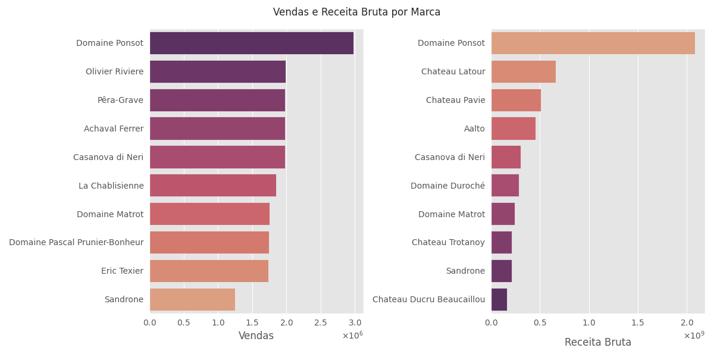

# Previsão de Demandas de Vinho com Séries Temporais

TAGS: Time Series, Prophet, ADF, KPSS, Statistical Analysis, Machine Learning, Scikit-learn, Pandas, Numpy, Matplotlib, Seaborn

  

> **Acesse o projeto completo aqui: [Notebook do Projeto](https://github.com/gabrielrflopes/Wine_Demand_Prediction/blob/main/P7_Previs%C3%A3o_de_Demandas_de_Vinhos_com_Time_Series.ipynb)**

## Entendimento do Problema

O vinho é uma bebida viva. Cada tipo de uva produz uma bebida com uma personalidade própria, que é ressaltada também pelo processo de produção. O resultado é uma bebida complexa, detalhada e cheia de nuances tanto no sabor quanto no aroma.

Por trazer tanta riqueza dentro da garrafa, carregando o trabalho e o cuidado de tantas pessoas, desde o plantio da uva até a venda, é preciso pensar em como armazenar  e transportar apropriadamente esse tipo de bebida. Nesse sentido, o lucro da empresa está diretamente associado à capacidade de logística no estoque, na guarda e no transporte, para que não se perca o vinho e o consumidor final receba um produto de qualidade.

A previsão de demanda diz respeito à capacidade de saber de antemão quais produtos os consumidores estão mais propensos a comprar e qual a estimativa do volume de vendas futuras, de modo que possamos organizar o estoque para gerar maior fluxo desses produtos e, consequentemente, mais lucro.

Para isso, avaliamos os dados históricos de venda e, com base neles, projetamos as vendas e prevemos a demanda para determinado período no futuro.

## Objetivos

Dentro do contexto de negócios que estamos tratando, é importante prestar atenção em alguns pontos, como a competição, a geografia e o tipo de produto. Portanto, alguns pontos que podemos focar no projeto são:

* Quais itens são mais vendidos;
* Quais itens são menos vendidos;
* Quais são os produtos mais lucrativos;
* Quais marcas convertem em maior receita;
* Quais estilos de vinho e de quais regiões os clientes preferem;
* Qual a demanda diária de produtos nas lojas;
* Qual a receita diária das lojas;
* Como a demanda atual se compara com períodos anteriores;
* Qual a projeção das vendas futuras.

Para alcançar esses objetivos, iremos utilizar da análise exploratória dos dados de 219 produtos e vendas num período de 3 anos, utilizando para isso as bibliotecas de análise de dados do Python, além do algoritmo de previsão do Meta, o Prophet.

## Resultados

Neste projeto, analisamos os dados sobre os produtos e vendas de 3 lojas de vinhos. Buscamos entender mais a fundo o contexto em que se está inserido o negócio de vendas de vinhos, estudando os desafios de manutenção, conservação, logística e satisfação do cliente.

* **Análise Exploratória**
  
A análise exploratória nos deu um panorama de como se relacionam os vinhos com as vendas e a receita bruta gerada por eles. Junto disso, visualizamos o impacto das marcas e regiões de produção nas vendas dos produtos, desenhando assim uma possível estratégia para ter um estoque com os produtos que mais tem fluxo de venda e retornam maior receita. A figura abaixo mostra uma das análises feita sobre a distribuição das vendas e da receita bruta por marca de vinho. A partir disto, pudemos concluir quais marcas convertem em maior receita, quais geram mais receita apesar das vendas mais baixas, e quais são de preferência do consumidor.

  

* **Objetivo da Construção do Modelo de Previsão**

Na parte de construção do modelo de previsão de demanda, utilizamos os dados de venda para criar uma série temporal. Nosso objetivo era o de ajustar o modelo do Prophet aos dados históricos, buscando minimizar os erros e maximizar a aderência dos dados, de modo que pudéssemos utilizar o modelo final para prever a demanda futura.

* **Testes de Estacionariedade**

Num primeiro momento, testamos a estacionariedade da série temporal através dos testes ADF e KPSS. Os testes apresentam abordagens distintas para testar se a série é estacionária ou não, e segundo os resultados de cada um, podemos diagnosticar se há estacionariedade ou não. No nosso caso, houve uma discordância entre os testes, de modo que constatamos que a série é não-estacionária por tendência.

* **Ajuste sobre a Série Não-estacionária**

Ainda assim, fizemos um primeiro ajuste do modelo sobre a série não-estacionária, de modo a termos um baseline para comparações. Os dados históricos foram muito bem ajustados pelo modelo, porém o erro absoluto médio (MAE = 1015,2) foi muito alto. Para termos boas previsões futuras, era preciso diminuir esse erro através do ajuste na série estacionária.

| **Métrica** | **Pontuação** |
|-------------|---------------|
| MAE         | 1015,2        |
| MAPE        | 0,02          |

De fato, se observamos o gráfico que mostra as previsões sobre os dados reais juntamente com os pontos de mudança identificados pelo modelo, fica claro que a série não-estacionária apresenta variações nos parâmetros estatísticos, mesmo ao diminuir a sensibilidade do modelo para identificar essas mudanças. A figura abaixo mostra esse gráfico, em que as linhas tracejadas em vermelho mostram os pontos onde foram identificadas mudanças significativas na direção dos dados.

  

- **Convertendo a Série Temporal**

Como a série é não-estacionária por tendência, segundo nossos testes estatísticos, é preciso aplicar uma transformação nos dados para que eles fiquem numa escala onde as variações dos parâmetros estatísticos se tornem desprezíveis. Para isso, aplicamos o logarítmo aos dados e sobre a média móvel, de modo que obtivemos uma série estacionária, com ambos os testes ADF e KPSS concordando na estacionariedade.

  

- **Ajuste do Modelo sobre a Série Estacionária**

Com o modelo ajustado sobre os dados estacionários, obtivemos o menor erro absoluto médio (MAE = 0,74) e o menor erro médio absoluto percentual (MAPE = 0,07), o que confirmou a acurácia do modelo.

| **Métrica** | **Pontuação** |
|-------------|---------------|
| MAE         | 0,74          |
| MAPE        | 0,07          |

Observando o gráfico com a previsão sobre os dados reais, nota-se a aderência do modelo e a capacidade de acompanhar as variações na tendéncia e as oscilações diárias das vendas.

  

- **Previsões Futuras e Limites do Modelo**

Realizando a previsão sobre os dados de 1 ano no futuro, conseguimos prever as vendas com um nível de confiança alto, e uma incerteza que se manteve dentro da oscilação esperada das vendas diárias.

  

Ao testar os limites do modelo, prevendo dois anos de vendas no futuro, começamos a ver os limites do intervalo de incerteza aumentar rapidamente, como esperado. Isto acontece porque começamos a realizar previsões numa escala de tempo comparável à dos dados históricos disponíveis (2 anos), de modo que começamos a ter uma composição de erros compostos sobre as previsões, aumentando assim o intervalo de incerteza.

  

## Conclusão

O modelo apresentou uma capacidade preditiva alta da demanda de vendas de vinhos até um ano no futuro. Com um erro absoluto médio (**MAE**) baixíssimo, de **0,74**, e um **MAPE abaixo de 10%**, trata-se de um modelo robusto, capaz de generalizar para novos dados no futuro e prever a demanda com precisão.
